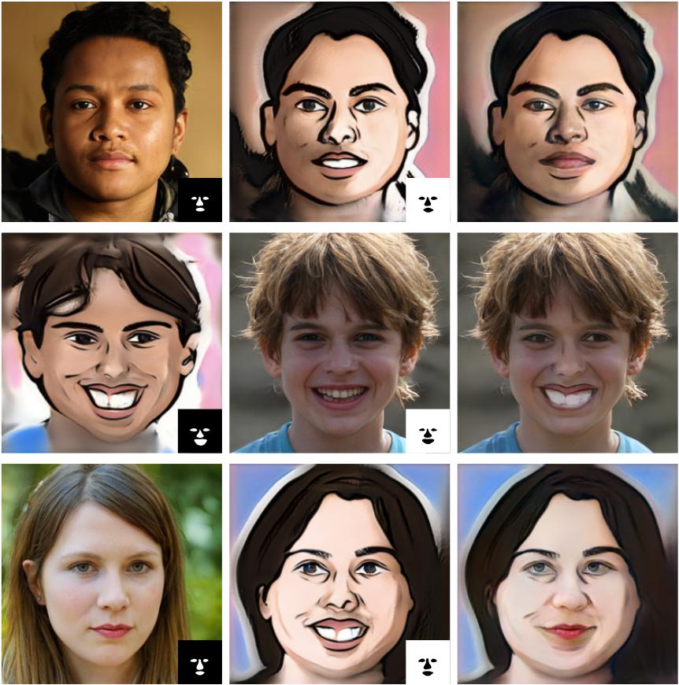
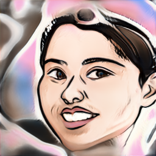
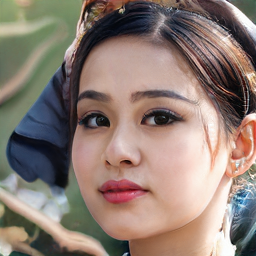
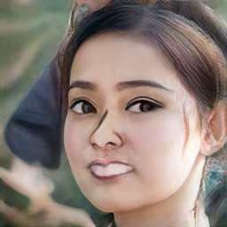
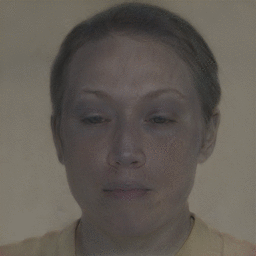
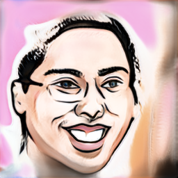
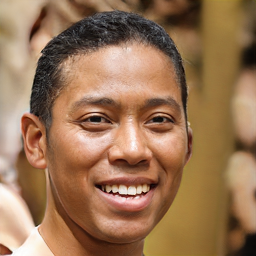
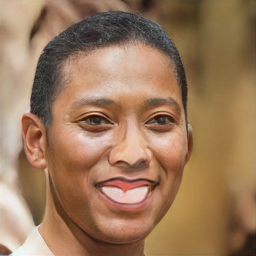
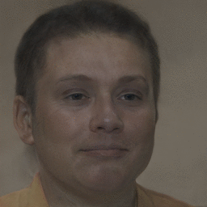

## Dual-Domain Image Synthesis Using Segmentation-Guided GAN 


Pytorch implementation of a segmentation-guided approach to synthesise images that integrate features from two distinct domains. 

<a href="https://arxiv.org/abs/22"></a>
<a href="https://openaccess.thecvf.com/content/"></a>
<a href="https://github.com/denabazazian/Dual-Domain-Synthesis/blob/main/LICENSE"></a> 


<!-- 
[[paper]](https://arxiv.org/pdf)
--> 


 
 

## Installation

- Clone Dual-Domain-Synthesis repository: 

```
git clone git@github.com:denabazazian/Dual-Domain-Synthesis.git
```

```
cd Dual-Domain-Synthesis
```

#### Environment

- Create the conda environment:

```bash
conda env create -f DDS.yml
```

- After installing the required environment dependencies: 

```bash
conda activate DDS
```

## Run

- Save the segmentation models: 
  - Code for train a segmentation model based on one labeled data. This code can be used to train a segmentation model to make the eyes/nose/mouth and hair masks. 
  - Generative model for natural faces can be downloaded from: [Link](https://drive.google.com/file/d/1PQutd-JboOCOZqmd95XWxWrO8gGEvRcO/view)
    - This code requires around 5GB of GPU memory and 5 minutes for running. There is a graphical user interface in the segmentation code to label the one-shot ground-truth for the training. 
    ```bash
    python save_segmentation_model.py --generator_dir path/to/generator  --segmentation_dir path/to/segmentation --part_key eyes
    ```

- Save the source and target generative models: 
  - For instance from [stylegan2-pytorch](https://github.com/rosinality/stylegan2-pytorch) and [few-shot-gan-adaptation](https://github.com/utkarshojha/few-shot-gan-adaptation)
    - Link to download the natural face generative model: [Link](https://drive.google.com/file/d/1PQutd-JboOCOZqmd95XWxWrO8gGEvRcO/view) 
    - Link to download the caricatur generative model: [Link](https://drive.google.com/file/d/1CX8uYEWqlZaY7or_iuLp3ZFBcsOOXMt8/view) 
    - Link to download the sketch generative model: [Link](https://drive.google.com/file/d/1Qkdeyk_-1pqgvrIFy6AzsSYNgZMtwKX3/view)

- Run the DDS code:  
First code is to run on a random sample_z, second code is for reproducing the results of Figure 5 in the paper by loading their sample_z, third code can be use on a random sample_z or loading a sample_z for saving the iterations of latent optimiser and making a gif of the iterations to see the process.  
(Each one of these following three codes requires around 5GB of GPU memory and 5 minutes for running.)

  - run a random sample_z:
   ```bash
  python DDS_main.py --generator_domain1_dir path/to/generator1 --generator_domain2_dir path/to/generator2 --segmentation_dir path/to/segmentation_root --part_key eyes_nose_mouth --save_path_root path/to/save_root
  ```
  - load a sample_z:  
  (The latent code [sample_z] of the examples in Figure 5 of the paper to reproduce the results.)
  ```bash
  python DDS_main.py --generator_domain1_dir path/to/generator1 --generator_domain2_dir path/to/generator2 --segmentation_dir path/to/segmentation_root --part_key eyes_nose_mouth --save_path_root path/to/save_root --sample_z_path path/to/sampleZ
  ```
  - save iterations:```
  python DDS_main.py --generator_domain1_dir path/to/generator1 --generator_domain2_dir path/to/generator2 --segmentation_dir path/to/segmentation_root --part_key eyes_nose_mouth --save_path_root path/to/save_root --save_iterations_path iterations --sample_z_path path/to/sampleZ ```
    - make a gif of the iterations: ```cd path/to/iterations```
      - domain1: ```convert -delay 20 -loop 0 *_D1.png DDS_D1.gif```
      - domain2: ```convert -delay 20 -loop 0 *_D2.png DDS_D2.gif```  


|Source| Target | Dual-Domain | Latent optimisation |
| -- |  -- | -- | -- |
| | | | |
| | | | |


### BibTeX
If you find our code useful, please cite our paper:

```
@inproceedings{bazazian2022DualDomain,
  title={Dual-Domain Image Synthesis Using Segmentation-Guided GAN},
  author={Bazazian, Dena and Calway, Andrew and Damen, Dima},
  booktitle={CVPR workshops},
  year={2022}
}
```

###  Acknowledgement  
As mentioned before, the StyleGAN2 model is borrowed from [stylegan2-pytorch](https://github.com/rosinality/stylegan2-pytorch), domain adaptation models are borrowed from [few-shot-gan-adaptation](https://github.com/utkarshojha/few-shot-gan-adaptation), code for the perceptual model is borrowed from [StyleGAN_LatentEditor](https://github.com/pacifinapacific/StyleGAN_LatentEditor) and source code for training the segmentation models is borrowed from [repurpose-gan](https://github.com/bryandlee/repurpose-gan).
